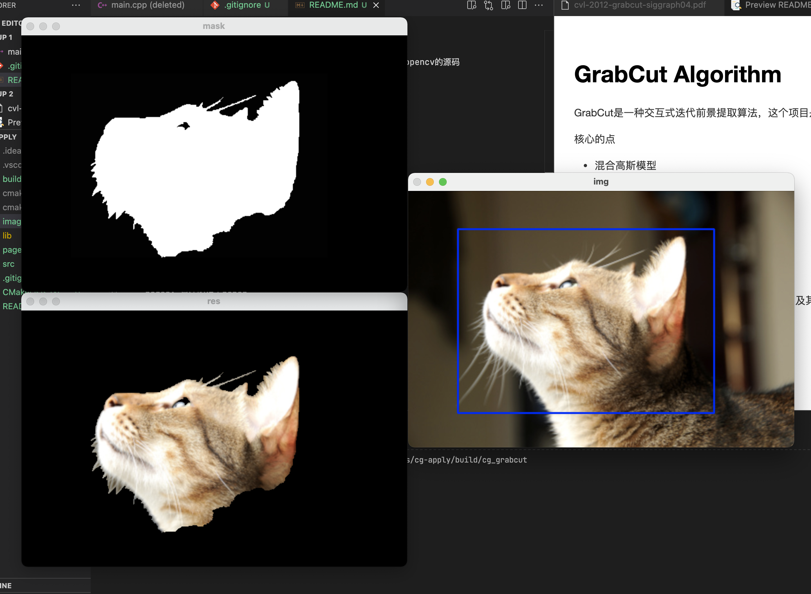
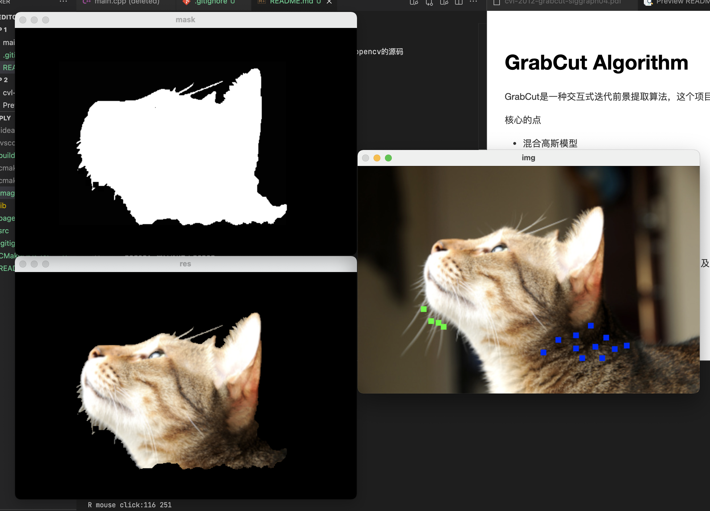

# GrabCut Algorithm

GrabCut是一种交互式迭代前景提取算法，这个项目是对其的实践，参考opencv的源码

核心的点
- 混合高斯模型
- 迭代图像分割
- Graph Cut
- border matting: 这个不是重点

opencv mask四状态  
- 背景`GCD_BGD`：0  
- 前景`GCD_FGD`：1
- 可能的背景`GCD_PR_BGD`：2
- 可能的前景`GCD_PR_FGD`：3

## 流程

### 初始化

1. 用户通过直接框选目标来得到一个初始的`GCD_PR_FGD`为$t_f$，即方框外的像素全部作为`GCD_BGD`为$t_b$

2. 对每一像素n，初始化像素n的标签

3. 通过像素标签来估计目标和背景的GMM，通过k-mean算法分别把属于目标和背景的像素聚类为K类，即GMM中的K个高斯模型

### 迭代最小化

1. 对每个像素分配GMM中的高斯分量

2. 对于给定的图像数据Z，学习优化GMM的参数

3. 分割估计（通过1中的Gibbs能量项，建立图，并求出权值t-link和n-link，通过max flow/min cut算法来进行分割）：

4. 重复步骤1-3，直到收敛

5. 对分割的边界进行`border matting`平滑处理

## 思考

如果GMM颜色模型换成颜色直方图[https://mmcheng.net/zh/salobj/](https://mmcheng.net/zh/salobj/)，可能对视觉显著性区域有更好的切割效果

## 代码

* main.cpp: 主要的用户交互逻辑  
* grabcut.hpp: grabcut算法的实现（含注释）及其依赖的GMM等  
* grabcut_ref.cpp: opencv中的样例的修改  

## 目录

- images: 测试用的图像文件
- lib: 可能用到的库
- pages: 算法的相关paper

## DEMO

框选并提取出 可能的前景`GCD_PR_FGD`，未被框则选为 背景`GCD_BGD`，按`n`获得初次分割结果

左键点击选取`GCD_FGD`，右键点击选取`GCD_BGD`，按`n`继续迭代更新

## Lib

* [opencv](https://github.com/opencv/opencv) Open Source Computer Vision Library
* [cmake](https://cmake.org/) CMake is an open-source, cross-platform family of tools designed to build, test and package software

## REF

* [读《"GrabCut" -- Interactive Foreground Extraction using Iterated Graph Cuts》](https://zhuanlan.zhihu.com/p/20255114)
* [图像分割之（二）Graph Cut（图割）](https://blog.csdn.net/zouxy09/article/details/8532111)
* [图像分割之（三）从Graph Cut到Grab Cut
](https://blog.csdn.net/zouxy09/article/details/8534954)